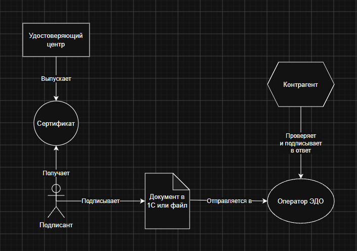

# Дневник: день 01

**Дата:**  26.07.2026
**Файл курса:** `curriculum/week-01/day-01.md`

## Что изучил

Что такое ЭДО и ЭП, виды ЭП, роли в системе.

ЭДО vs ЭП (одним абзацем)
ЭДО - это обмен и учёт электронных документов. Какой документ, от кого пришёл, кому адресован. ЭП - это реквизит электронного документа, который подтверждает, что документ подписал именно этот контрагент, и он не изменял содержимое после подписи. ЭДО без подписи не имеет юридической силы. ЭП имеет силу без ЭДО, но обычно используются вместе.

Карта ролей

| Документ                      | Нужен ли ЭДО с оператором? | Какой вид ЭП уместен? | Почему                                   |
| ----------------------------- | -------------------------- | --------------------- | ---------------------------------------- |
| УПД покупателю                | Да                         | КЭП                   | Обмен через оператора + КЭП для юрсилы   |
| Договор с контрагентом        | Не обязательно             | КЭП                   | КЭП или НЭП по соглашению                |
| Внутренний приказ по компании | Не обязательно             | НЭП                   | Для внутреннего ЭДО нет строгих правил   |
| Вход в личный кабинет         | Нет                        | ПЭП                   | Служит в качестве личного идентификатора |

- 

## Что сделал на практике

1. Сформулировал разницу между ЭДО и ЭП
2. Нарисовал карту ролей в системе
3. Заполнил таблицу требований к ЭП

- 

## Ошибки / сюрпризы

Пока всё гладко

- 

## Вопросы на потом

Как работает проверка подписи?

- 

## Чеклист дня

- [x] Теория прочитана
- [x] Практика выполнена (или бумажный вариант)
- [x] Чеклист в day-NN отмечен